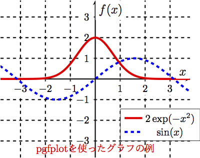

不幸にして最近まで知らなかったが，LaTeX上で関数やデータを可視化するのにPGFPlotsが便利。
LaTeXファイルでデータファイルを読み込んでグラフ化することもできる。


### 簡単な三次元グラフの例


```
\documentclass[dvipdfmx]{jsarticle}
\usepackage{pgfplots}
\pgfplotsset{width=8cm,compat=1.14}

\begin{document}

\begin{tikzpicture}
\begin{axis}
\addplot3[
    surf,
]
{exp(-(x^2+y^2)/4};
\end{axis}
\end{tikzpicture}

\end{document}
```
`platex+dvipdfmx`で処理できます。

### 簡単な2次元グラフの例(LaTeXのヘッダ部はなし)


```
\begin{tikzpicture}
\begin{axis}[axis lines=center, grid=both, samples=100, domain=-1.5:4]
\addplot [color=blue]{exp(-x)};
\addplot [color=blue]{-exp(-x)};
\addplot [color=green]{sin(deg(4*x))};
\addplot [color=red, line width=2]{exp(-x)*sin(deg(4*x))};
\end{axis}
\end{tikzpicture}
```

### 少し細かい設定をした例



```

\begin{tikzpicture}
\begin{axis}[
    axis lines=center,
    axis line style={line width=1pt},
    xmin=-3.8,
    xmax=3.8,
    ymin=-3.8,
    ymax=3.8,
    xlabel = ${x}$,
    ylabel = {$f(x)$},
    label style={font=\large,fill=white},
    grid = both,
    grid style ={line width=1pt, dashed, draw=black},
    xtick={-4,-3,...,4},
    ytick={-4,-3,...,4},
    minor tick num=0,
    tick label style={fill=white},
    legend style={at={(axis cs:1,-3)},anchor=south west},
    samples=100, 
]
\coordinate (O) at (axis cs:0,0);

\addplot [solid, color=red, line width=2pt]{2*exp(-x^2)};
\addplot [dashed, color=blue, line width=2pt]{sin(deg(x))};
\addlegendentry{$2\exp(-x^2)$}
\addlegendentry{$\sin(x)$}
\node[above,red] at (axis cs:0,-3.8) {pgfplotを使ったグラフの例};
\end{axis}
\end{tikzpicture}

```

### その他

当然，`tikzpicture`環境をたくさん使うことで，１つのLaTeX文書中にグラフをいくつも埋め込むこともできる。
このとき，個々のグラフのpdfファイルを個別に出力したい時には`pdflatex`を利用し，ヘッダ部に少し設定を追加する。

```
\documentclass[pdflatex,ja=standard]{bxjsarticle}  %<= pdflatexを使うための文書クラス定義
\usepackage{pgfplots}
\pgfplotsset{width=8cm}

%ここから，個々のグラフ出力のための設定
\usepgfplotslibrary{external} 
\tikzexternalize
% ここまで

\begin{document}
…

\end{document}
```
pdfに変換する時には以下のコマンドで。
```
$ dflatex --shell-escape <TeXファイル名>
```

### リンク
- [PGFPlots Gallery (いろいろなサンプル)](http://pgfplots.sourceforge.net/gallery.html)
- [PGFPlotsのホームページ](http://pgfplots.sourceforge.net/)
