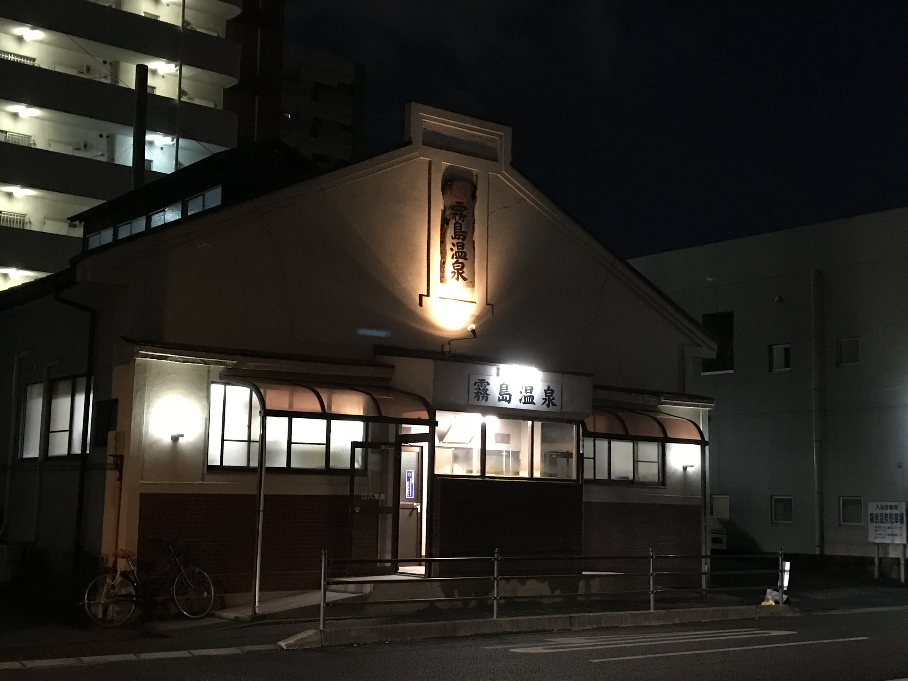

人工知能学会の大会が[2012年に山口で開催](http://2012.conf.ai-gakkai.or.jp/)されたときに運営のお手伝いをしたのがきっかけで，人工知能学会に時々行くようになった。山口大会の開催日は6/12-15だったので，今思えば，ディープラーニングの起爆剤の一つになった[Googleによる猫画像自動認識のニュース(2012/6/26)](https://www.nytimes.com/2012/06/26/technology/in-a-big-network-of-computers-evidence-of-machine-learning.html?pagewanted=all)が世に出るほんの10日くらい前。この時の大会ではディープラーニングに関する話題は多分無かったのではないかと思う。

<!--more-->

当時でも活気のある学会だったが，その6年後の[今回の大会](https://www.ai-gakkai.or.jp/jsai2018/)では参加者数は約2.5倍の2500名強(過去最多)，ディープラーニング関連のいろいろなチュートリアルやセッションが企画されて隔世の感を感じてしまう。
企業ブースにはIntel, NVIDIA, IBM, Microsoft, Amazonなどなど数十社がブースを並べて虎視眈々と生きの良い学生を狙っていて(ちょっと言いすぎか?)，時代の潮流にのってる感が半端ない。

もっとも，華々しい応用事例だけではなく，生物が知能が獲得したメカニズムを問うような基礎的だけど(だからこそ?)大変刺激的な研究発表も多く，夜には温泉にも行けて大変満足です。

