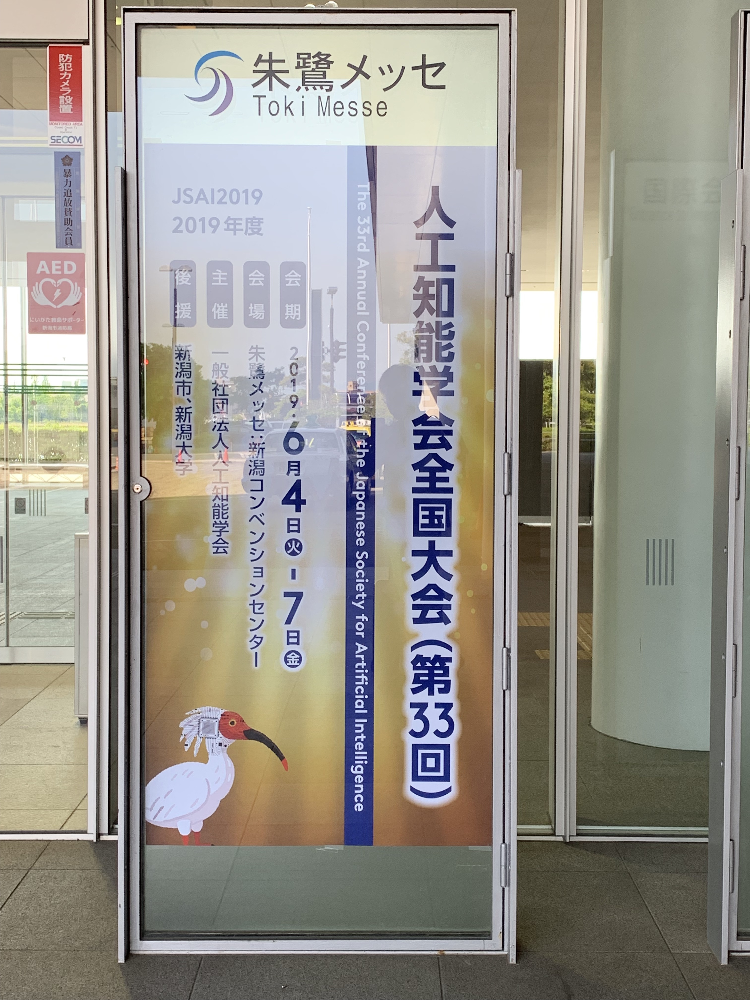

<!---->
<!---->

今年も[人工知能学会全国大会](https://www.ai-gakkai.or.jp/jsai2019/)に行ってきた。
ちなみに，昨年のレポートは[こちら](../180607-jsai)。

<!--more-->

ディープラーニング万歳な雰囲気はだいぶん薄れてきて，その限界は何かを見据えて次を考えようという議論が，当然と言えば当然だが増えてきた気がする。

チュートリアル講演は昨年より少なかったが，今年もGoogleやらNVIDIAやらIBMやらAmazon やらといった大手ITメーカはこぞってランチョンセミナーを開催していて，企業ブースでも結構な数のデータサイエンス系企業が技術宣伝や，インターンシップ募集や求人の案内をしていた。

情報系の人間としては求人が多いようで何よりだが，数学的な基礎知識からデータ解析の基本的な体系をきちんと身につけている人を募集するぞという意思を明確にした求人も多く，博士後期課程の在学者や博士号取得者を対象にした求人もある。

数年前だと「ディープラーニングのプログラムを書いたことがあると就職しやすくなる」と囁いていた人もいたが，とりあえずディープラーニングのプログラムを書くだけなら，ちょっとプログラミングの知識があればすぐできる([例えば「ここ」](http://bcl.sci.yamaguchi-u.ac.jp/~jun/notebook/keras)とか見てね)。しかし，良いデータ解析をしようとすると，結局のところデータ解析のための様々な手法の知識や，数学的な基礎知識が必要になる。

今後はきっちりと技術を持っているとそれなりの高収入を狙えるようになる一方で，中途半端な技術しか持っていないと相手にされなくなるんじゃないかなと感じる次第。
というわけで情報科学科学専攻のみなさん，しっかり勉強しましょうね。(by 情報コースの就職担当教員)

