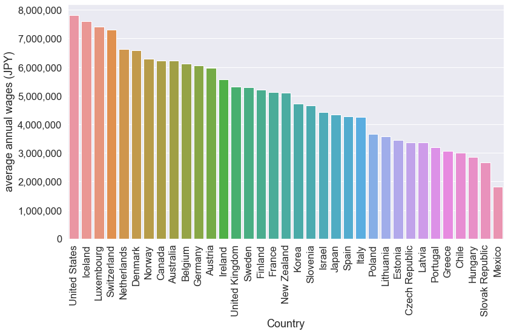
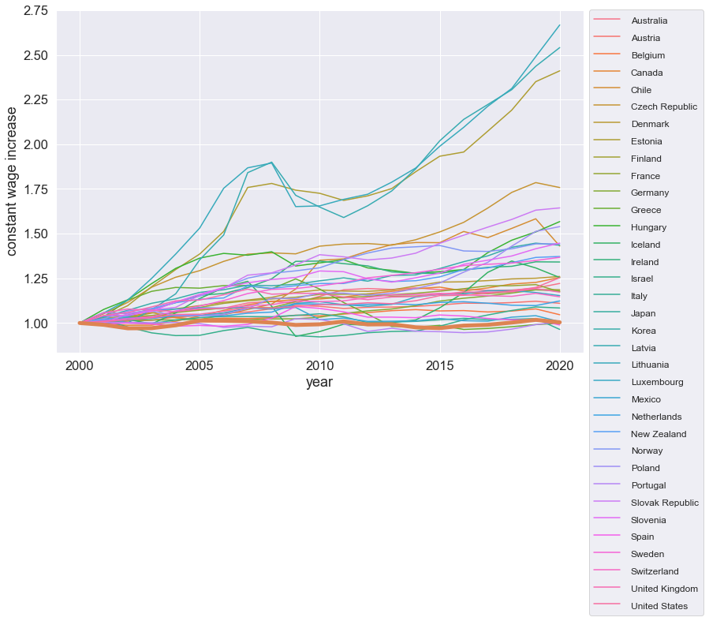
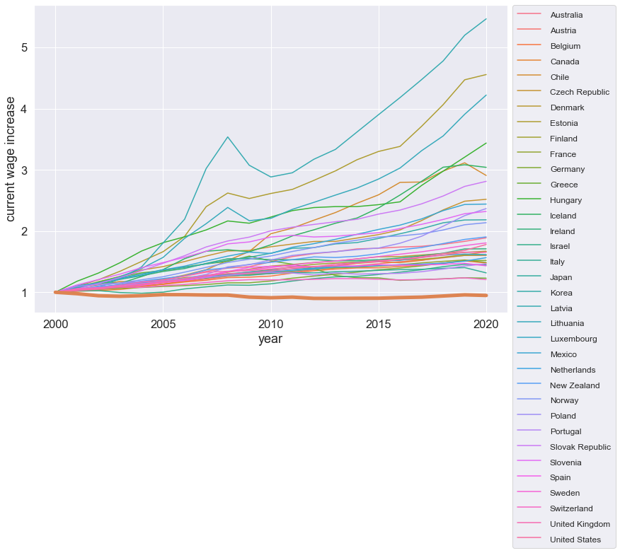

OECDのサイトに[各国の平均年収のデータ](https://stats.oecd.org/Index.aspx?DataSetCode=RMW)があったのでPythonでグラフにしてみた。

## ライブラリとデータの読み込み


```python
import pandas as pd
import matplotlib.pyplot as plt
import matplotlib.ticker as ticker
import seaborn as sns
import plotly.express as px

file = "AV_AN_WAGE_22072021122640139.csv"  # ダウンロードしたデータ
df = pd.read_csv(file)
```

データの中身はこんなかんじ


```python
display(df.head(3))
```


<div>
<style scoped>
    .dataframe tbody tr th:only-of-type {
        vertical-align: middle;
    }

    .dataframe tbody tr th {
        vertical-align: top;
    }

    .dataframe thead th {
        text-align: right;
    }
</style>
<table border="1" class="dataframe">
  <thead>
    <tr style="text-align: right;">
      <th></th>
      <th>COUNTRY</th>
      <th>Country</th>
      <th>SERIES</th>
      <th>Series</th>
      <th>TIME</th>
      <th>Time</th>
      <th>Unit Code</th>
      <th>Unit</th>
      <th>PowerCode Code</th>
      <th>PowerCode</th>
      <th>Reference Period Code</th>
      <th>Reference Period</th>
      <th>Value</th>
      <th>Flag Codes</th>
      <th>Flags</th>
    </tr>
  </thead>
  <tbody>
    <tr>
      <th>0</th>
      <td>AUS</td>
      <td>Australia</td>
      <td>CPNCU</td>
      <td>Current prices in NCU</td>
      <td>2000</td>
      <td>2000</td>
      <td>AUD</td>
      <td>Australian Dollar</td>
      <td>0</td>
      <td>Units</td>
      <td>NaN</td>
      <td>NaN</td>
      <td>46286.111081</td>
      <td>NaN</td>
      <td>NaN</td>
    </tr>
    <tr>
      <th>1</th>
      <td>AUS</td>
      <td>Australia</td>
      <td>CPNCU</td>
      <td>Current prices in NCU</td>
      <td>2001</td>
      <td>2001</td>
      <td>AUD</td>
      <td>Australian Dollar</td>
      <td>0</td>
      <td>Units</td>
      <td>NaN</td>
      <td>NaN</td>
      <td>48366.628479</td>
      <td>NaN</td>
      <td>NaN</td>
    </tr>
    <tr>
      <th>2</th>
      <td>AUS</td>
      <td>Australia</td>
      <td>CPNCU</td>
      <td>Current prices in NCU</td>
      <td>2002</td>
      <td>2002</td>
      <td>AUD</td>
      <td>Australian Dollar</td>
      <td>0</td>
      <td>Units</td>
      <td>NaN</td>
      <td>NaN</td>
      <td>50109.137562</td>
      <td>NaN</td>
      <td>NaN</td>
    </tr>
  </tbody>
</table>
</div>


`SERIES`列には`CPNCU`, `CNPNCU`, `USDPPP`が出てきて，`Series`列の省略形になっている。

- `CPNCU`は`Current prices in NCU`
- `CNPNCU`は`2020 constant prices and NCU`
- `USDPPP`は`In 2020 constant prices at 2020 USD PPPs`

経済には疎くて用語がわからないのでGoogleで調べてみた
- current prices : 名目賃金(額面金額)
- constant prices : 実質賃金(インフレによる通貨価値の減少を考慮した金額)
- USD PPPs: 各国の購入力を考慮したUSDへの換算レート([Purchasing Power Parity](http://uis.unesco.org/en/glossary-term/purchasing-power-parity-ppp))

上記の`CPNCU`と`CNPNCU`は自国通貨でのcurrent pricesとconstant prices。`USDPPP`はインフレ率を勘案したUSDへの換算額(2020年度)ということらしい。

## 最新データ(2020年)による年収ランキング

- インフレ率分割り引いた年収ランキング(USDPPP)
- 1ドル112.58円(上記データで2020年度データに使われている換算レート)で換算す


```python
# reshape data
usdjpy = 112.58

# ranking data
ranking = df[(df["Time"] == df["Time"].max()) & (df["SERIES"] == "USDPPP")].sort_values(
    by="Value", ascending=False
)
ranking["Value"] = ranking["Value"] * usdjpy


# plot data

sns.set_theme(
    rc={"figure.figsize": (12, 8),}, style="darkgrid",
)
sns.set_context("notebook", font_scale=1.5)

ax = sns.barplot(x="Country", y="Value", data=ranking)
ax.set(ylabel="average annual wages (JPY)")
plt.xticks(rotation=90)
plt.gca().yaxis.set_major_formatter(
    plt.matplotlib.ticker.StrMethodFormatter("{x:,.0f}")
)

plt.tight_layout()
```

   

    
日本はどこか探してみてください。

## 賃金の年次変化(matplotlib版)
### 実質賃金の推移

まずはUSDPPP(インフレ率分割り引いた実質賃金)のデータ表示。各国の2000年の賃金を1とする。

```python
dot_usdppp = df[df["SERIES"] == "USDPPP"][["Country", "Value", "TIME"]].pivot(
    index="TIME", columns="Country", values="Value"
)
dot_usdppp = dot_usdppp.div(dot_usdppp.iloc[0])
dot_usdppp.head(3)
```


<div>
<style scoped>
    .dataframe tbody tr th:only-of-type {
        vertical-align: middle;
    }

    .dataframe tbody tr th {
        vertical-align: top;
    }

    .dataframe thead th {
        text-align: right;
    }
</style>
<table border="1" class="dataframe">
  <thead>
    <tr style="text-align: right;">
      <th>Country</th>
      <th>Australia</th>
      <th>Austria</th>
      <th>Belgium</th>
      <th>Canada</th>
      <th>Chile</th>
      <th>Czech Republic</th>
      <th>Denmark</th>
      <th>Estonia</th>
      <th>Finland</th>
      <th>France</th>
      <th>...</th>
      <th>Norway</th>
      <th>Poland</th>
      <th>Portugal</th>
      <th>Slovak Republic</th>
      <th>Slovenia</th>
      <th>Spain</th>
      <th>Sweden</th>
      <th>Switzerland</th>
      <th>United Kingdom</th>
      <th>United States</th>
    </tr>
    <tr>
      <th>TIME</th>
      <th></th>
      <th></th>
      <th></th>
      <th></th>
      <th></th>
      <th></th>
      <th></th>
      <th></th>
      <th></th>
      <th></th>
      <th></th>
      <th></th>
      <th></th>
      <th></th>
      <th></th>
      <th></th>
      <th></th>
      <th></th>
      <th></th>
      <th></th>
      <th></th>
    </tr>
  </thead>
  <tbody>
    <tr>
      <th>2000</th>
      <td>1.000000</td>
      <td>1.000000</td>
      <td>1.000000</td>
      <td>1.000000</td>
      <td>1.00000</td>
      <td>1.000000</td>
      <td>1.000000</td>
      <td>1.000000</td>
      <td>1.000000</td>
      <td>1.000000</td>
      <td>...</td>
      <td>1.000000</td>
      <td>1.000000</td>
      <td>1.000000</td>
      <td>1.000000</td>
      <td>1.000000</td>
      <td>1.000000</td>
      <td>1.000000</td>
      <td>1.000000</td>
      <td>1.000000</td>
      <td>1.000000</td>
    </tr>
    <tr>
      <th>2001</th>
      <td>1.010883</td>
      <td>0.996962</td>
      <td>1.003084</td>
      <td>0.995891</td>
      <td>1.02740</td>
      <td>1.051571</td>
      <td>1.006660</td>
      <td>1.034993</td>
      <td>1.005260</td>
      <td>1.006325</td>
      <td>...</td>
      <td>1.024379</td>
      <td>1.057132</td>
      <td>1.004056</td>
      <td>1.000000</td>
      <td>1.040772</td>
      <td>0.994779</td>
      <td>1.011863</td>
      <td>1.057034</td>
      <td>1.042075</td>
      <td>1.008469</td>
    </tr>
    <tr>
      <th>2002</th>
      <td>1.017842</td>
      <td>1.012392</td>
      <td>1.028910</td>
      <td>0.987594</td>
      <td>1.03634</td>
      <td>1.115248</td>
      <td>1.029816</td>
      <td>1.096847</td>
      <td>1.010661</td>
      <td>1.033491</td>
      <td>...</td>
      <td>1.066971</td>
      <td>1.054004</td>
      <td>1.003560</td>
      <td>1.051607</td>
      <td>1.043738</td>
      <td>0.999752</td>
      <td>1.025093</td>
      <td>1.077983</td>
      <td>1.058818</td>
      <td>1.016417</td>
    </tr>
  </tbody>
</table>
<p>3 rows × 35 columns</p>
</div>


グラフ表示は関数にしておく。


```python
def plot_change(df, ylabel="wage increase"):
    sns.set_context("notebook", font_scale=1.5)
    ax=sns.lineplot(data=df, dashes=False)
    sns.lineplot(data=df["Japan"], palette="Red",linewidth=5, dashes=False)

    plt.legend(bbox_to_anchor=(1.01, 1), borderaxespad=0)
    ax.set(xlabel="year", ylabel=ylabel)
    ax.xaxis.set_major_locator(ticker.MultipleLocator(5))
    plt.setp(ax.get_legend().get_texts(), fontsize="12") # for legend text
    plt.show()

plot_change(dot_usdppp, ylabel="constant wage increase")
```


    

    
日本はオレンジの太線で上書きしている。安定性抜群なことがわかる。

名目賃金のグラフも作ってみる。


```python
dot_cpncu = df[df["SERIES"] == "CPNCU"][["Country", "Value", "TIME"]].pivot(
    index="TIME", columns="Country", values="Value"
)
dot_cpncu = dot_cpncu.div(dot_cpncu.iloc[0])
plot_change(dot_cpncu,ylabel="current wage increase")
```
    


日本は座標軸のように横に伸びている。
外資系の企業から給料をもらって，日本で暮らすというのがお得かもしれない。
IT系だったらリモーワーク可のところも増えているみたいだしね。

