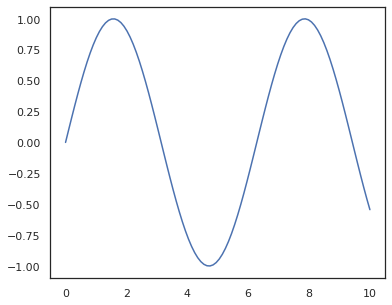
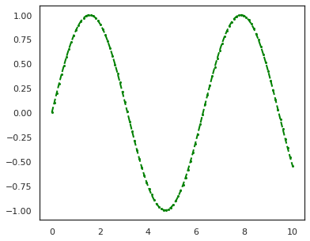

Pythonのmatplotlibを使って数学関数のグラフを作ろうとすると、ちょいと面倒だったりするが、以下のような関数を作っておくと便利。
ポイントは、引数の一つを描画したい数学関数にすることと、描画のための引数を可変引数で指定できるようにすること。
<!--more-->

```python
import matplotlib.pyplot as plt
import numpy as np

def plot_function(fn,**kwargs):
    x = np.linspace(0, 10, 100)
    y = fn(x)

    plt.plot(x, y, **kwargs)
    plt.show()

plot_function(fn=np.sin)
```


必要に応じて、`plt.plot()`に色々な引数を渡せる。

```python
plot_function(fn=np.sin, color='green', marker='o', linestyle='dashed', linewidth=2, markersize=2)
```


関数の引数を可変個にすることについての詳しい説明は、[「関数の引数」](/notebook/python/funcion)に書いておきました。