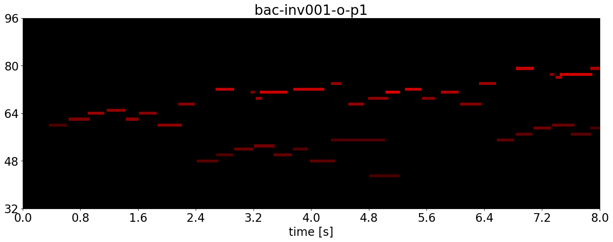
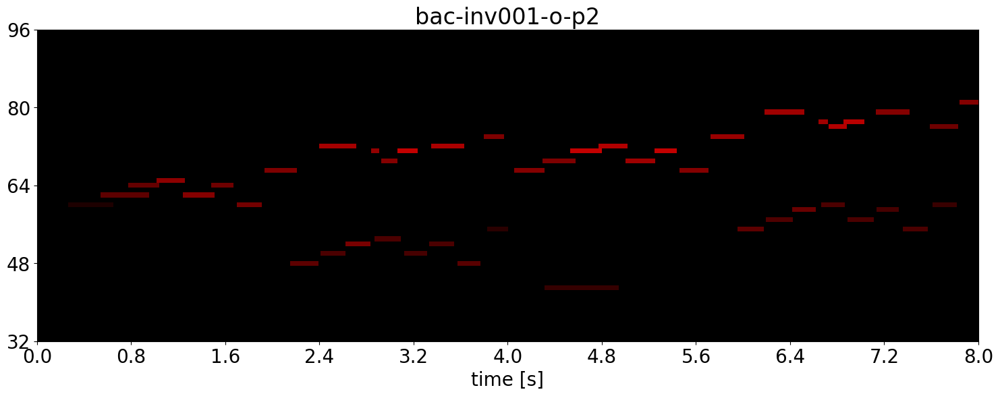



何人かのピアニストの演奏のMIDIファイルを公開している演奏表情データベース[Crest MusePEDB](https://crestmuse.jp/pedb2/)がある。
サンブルファイルにバッハのインベンション1番のMIDIファイルがあったので可視化してたら面白かった。

<!--more-->

それぞれ別のピアニストによるもの。
一人目のピアニストの場合，音と音の重なりは少なくいことあることから，ノンレガートで弾いていることがわかる。
一方で，二人目のピアニストは出だしのドレミを重ねてはじめており(はじめのドが薄くてみづらくすみません)，他の部分も音を重なりが多い。この3つの音を重ねると濁るが，チェンバロなどのバロック楽器では，音量の変化や音色の変化を作るためにこのような弾き方をすることは多いので，このピアニストはバロック楽器の勉強をしたことがあるのかもしれない。

個々の音の長さに着目すると，どちらのピアニストも同じ長さを表す音符であっても実際の演奏の長さは結構変えている。
バッハはリズムは崩さないで弾くようにと指導されることが多い気がするが，実際の演奏ではこのように決してメトロノーム通りということはない。
(テンポを無茶苦茶にするとリズム音痴な演奏になるので，決して適当にテンポを変えていいというわけでもない。そういう意味でまずはメトロノーム通りに弾けるようにするのは大事と思っている)

左手の出だしのテーマ部分では，一人目のピアニストは少し音符ごとの長さを変えて歌っているが，二人目のピアニストの場合は長さの変化は少ない。
つまり，二人目のピアニストは，右手は歌って，左手やや淡々と弾くことで対比を強調しているらしい。
色の明暗は音の強さ(厳密にはMIDIのベロシティ)を表しているが，左に来たテーマを大きく弾いているわけでもなく，むしろ右手を大きく弾いている。

見てわからない情報を可聴化することで理解しやすくするsonificationの研究がいろいろあるが，聞いてわかりにくい情報を可視化してわかることもたくさんあって面白い。

ちなみに，MIDIの可視化には[こちら](https://github.com/exeex/midi-visualization/)にあったソースコードを改造したもの([github](https://github.com/jnishii/midi-visualization))を使っている。

<!--なお，インベンションの楽譜は[Mutopia Project](https://www.mutopiaproject.org/cgibin/make-table.cgi?collection=bachis&preview=1)のもの。-->