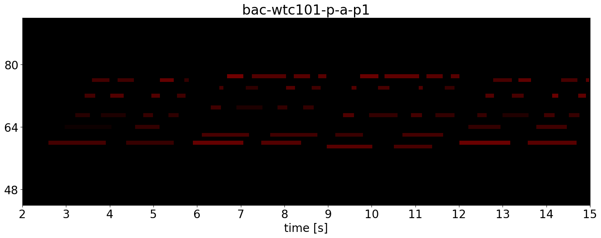
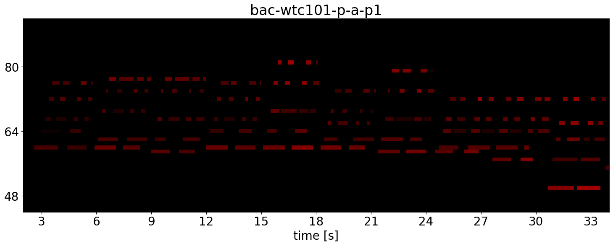



MIDI解析シリーズ第二弾はバッハの平均律1巻1番のプレリュード。バッハって誰やねんていう人も，どこかで聞いたことはある曲のはず。
右手はずっと16分音符の分散和音なので，楽譜上の音の長さは全て同じ。

<!--more-->

図で示すピアニストの演奏([CrestMusePEDB](https://crestmuse.jp/pedb2/) 第２版のサンプルより。上記Youtubeビデオとは別の演奏です)では，最高音は長く，2番目に高い音は短めで，3番目の音はやや長い。
最高音のみに注目しても，いつも同じ長さではなく，3,4倍くらいの長さの変動はある。また，1小節ごとの緩い周期的な変動をしていて，この揺らぎで小節単位のリズム感を表現しているらしい。

この小節内変動や小節毎の違いが音楽に何らかの表情を与えているはずだなとか思って眺めていると，出だしのベースは長めにして注意を惹きつけるようにしたのかなとか，1小節目は静かに出て，2小節目冒頭の左手でドとレの音がぶつかり濁るところを少しだけ強く弾いてコントラストを出していることに気づく。

さらに長い範囲を表示してみたのが上の図。
どの声部も小節線のところでの音の切れるがやや長く，小節の単位が明確になるようにしていることがわかる。
また，音域(ソプラノとバスの間隔)が広がるところでは音量も大きくしてコントラストを強調している。
見てるだけで飽きないが，法則性のようなものを機械学習で抽出したいなと考え中。
